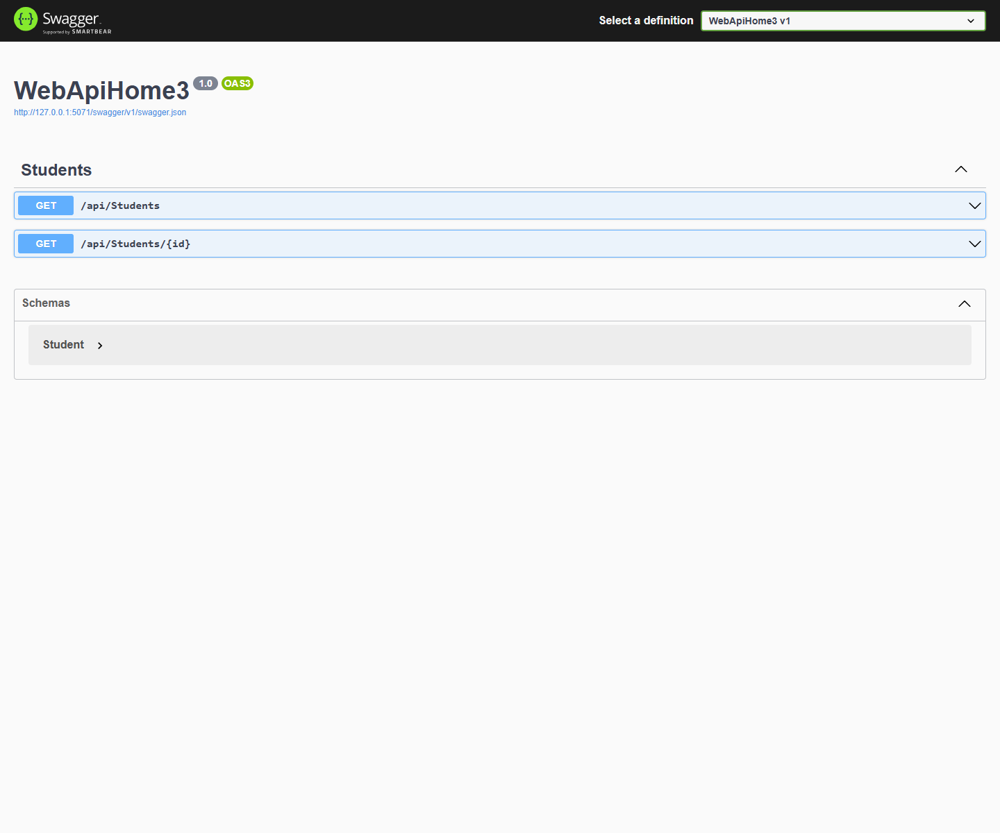
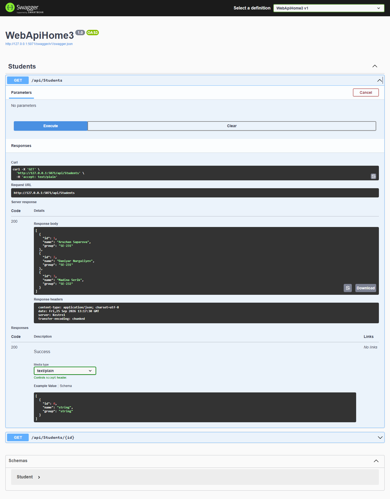
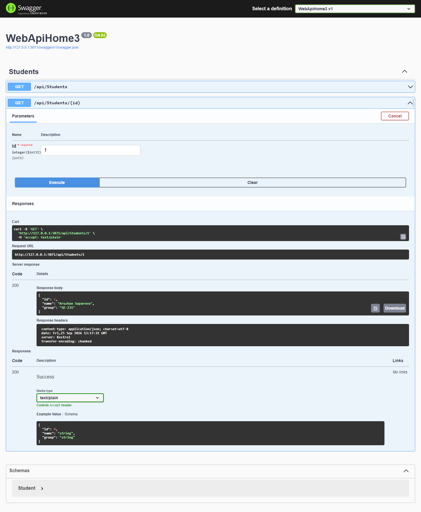
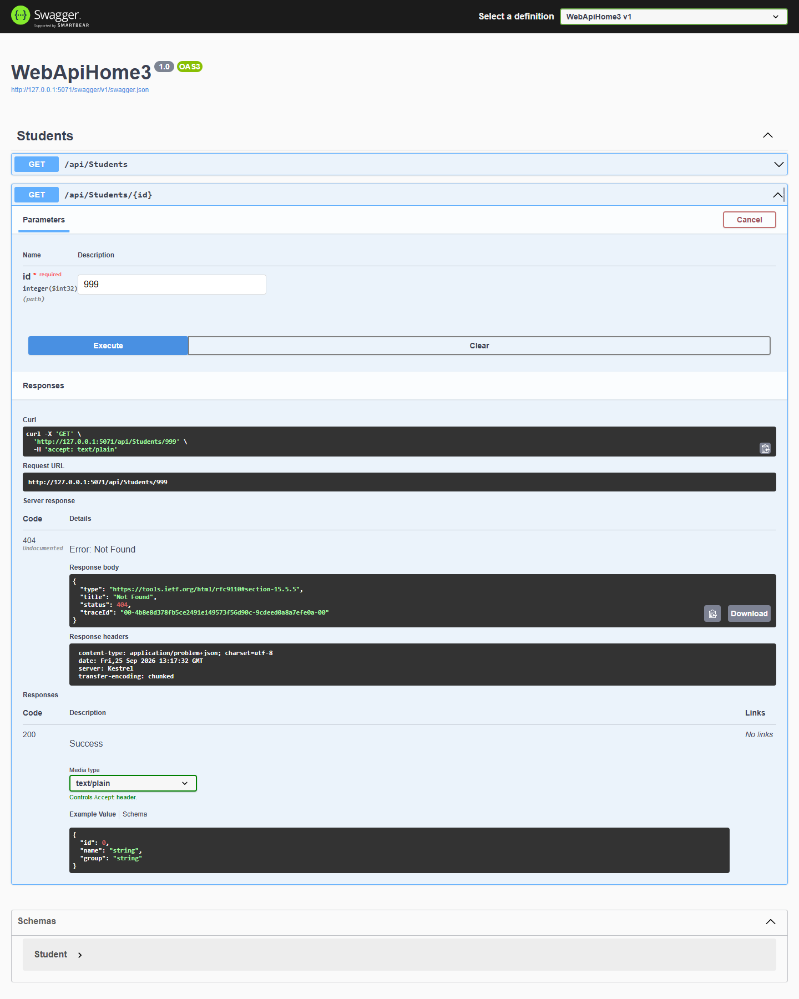
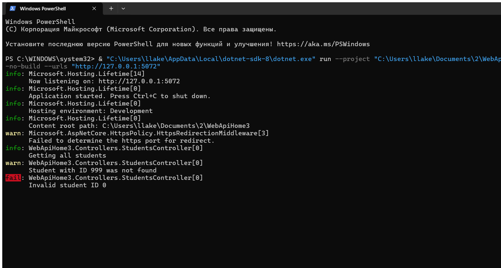

# Домашняя работа — Модуль 03: Dependency Injection и логирование

**CSE5032 · Разработка веб-сервисов · Модуль 03**

Цель — применить внедрение зависимостей и логирование. Операции со студентами вынесены в `StudentService`, а контроллер зависит от интерфейса `IStudentService` и не создаёт сервис через `new`. В `Program.cs` зарегистрировано соответствие интерфейса реализации с жизненным циклом Transient. Логгер внедрён тем же способом. Покажу список, найденного студента и 404, а затем сообщения журнала. В дополнительной части сравнивается Transient с Singleton.

---

## Цель

Закрепить DI, интерфейсы, регистрацию сервиса и `ILogger<T>` на примере API студентов.

## Краткий отчёт

`StudentService` реализует `IStudentService`, хранит три демонстрационные записи и регистрируется как `Transient`. `StudentsController` получает сервис и логгер через конструктор; API предоставляет список и поиск по Id.

## Выполнение по шагам

| Шаг по заданию | Реализация | Для чего |
|---|---|---|
| 1. Модель `Student` | `Id`, `Name`, `Group` | Описывает возвращаемые данные студента |
| 2. Сервис | `IStudentService.GetAll()` и `GetById(int)`; в `StudentService` добавлены три студента | Отделяет чтение данных от HTTP-контроллера |
| 3. Регистрация DI | `AddTransient<IStudentService, StudentService>()` в `Program.cs` | Позволяет контейнеру создавать реализацию для интерфейса |
| 4. Constructor Injection | Контроллер получает `IStudentService` параметром конструктора | Контроллер не создаёт сервис вручную через `new` |
| 5. Логирование | Внедрён `ILogger<StudentsController>`; применяются Information, Warning и Error | Записывает штатный запрос, отсутствие записи и некорректный Id |
| 6. Проверка | Swagger: список, существующий Id, отсутствующий Id; PowerShell: журналы | Подтверждает ответы API и работу журнала |

## Модель `Student`

| Свойство | Тип | Назначение |
|---|---|---|
| `Id` | `int` | Идентификатор |
| `Name` | `string` | Имя |
| `Group` | `string` | Учебная группа |

## Endpoint

| Метод | Endpoint | Назначение | Результат |
|---|---|---|---|
| `GET` | `/api/students` | Получить всех студентов | `200 OK` |
| `GET` | `/api/students/{id}` | Получить запись по Id | `200 OK`, `404 Not Found`; Id `0` даёт `400 Bad Request` |

## Пример ответа JSON

```json
{
  "id": 1,
  "name": "Aruzhan Saparova",
  "group": "SE-231"
}
```

## Проверка и скриншоты

### Шаг 1. Swagger и список операций



### Шаг 2. Список студентов — `GET /api/students`



### Шаг 3. Существующий студент — `GET /api/students/1`



### Шаг 4. Отсутствующий студент — `GET /api/students/999`



### Шаг 5. Журнал приложения



> В задании также требуется отдельный снимок регистрации сервиса в `Program.cs`. В текущем `docs` такого снимка нет; регистрация присутствует в исходном коде. Скриншот регистрации в `Program.cs` в текущем комплекте отсутствует.

## Жизненные циклы DI

| Жизненный цикл | Когда создаётся экземпляр | Типичный случай |
|---|---|---|
| `Transient` | При каждом разрешении зависимости | Лёгкий сервис без состояния |
| `Scoped` | Один раз в пределах HTTP-запроса | Сервис, работающий с `DbContext` |
| `Singleton` | Один раз на всё время работы приложения | Общий потокобезопасный объект или кэш |

В этой работе выбран `Transient`. `Singleton` переиспользовал бы один объект всё время работы приложения; это важно учитывать, если сервис хранит изменяемые данные.

## Контрольные вопросы

1. **Что такое Dependency Injection (DI)?** — Приложение передаёт контроллеру нужный сервис, вместо того чтобы контроллер создавал его сам.
2. **Зачем использовать интерфейс вместо `new`?** — Контроллер зависит от общих правил интерфейса, поэтому реализацию легче заменить или проверить отдельно.
3. **Что такое Constructor Injection?** — Сервис передаётся контроллеру через параметр конструктора.
4. **Зачем регистрировать сервис в `Program.cs`?** — Чтобы DI-контейнер знал, какой класс использовать для интерфейса и как долго хранить его экземпляр.
5. **Для чего нужен `ILogger<T>`?** — Он записывает события в журнал и указывает, из какого класса пришло сообщение.
6. **Чем отличаются `Information`, `Warning` и `Error`?** — `Information` сообщает о штатном событии, `Warning` предупреждает о возможной проблеме, `Error` отмечает ошибку.
7. **Чем Transient отличается от Singleton?** — Transient создаёт новый экземпляр при каждом запросе зависимости. Singleton создаёт один экземпляр на всё приложение, общий для всех запросов.

## Вывод

В работе связаны интерфейс, реализация сервиса, DI и логгер. Swagger подтверждает успешное чтение и корректную обработку неизвестного идентификатора.
